# DeepAudioLab — User Manual

*A no-code application for training, evaluating and deploying audio models*

## Table of Contents

- [1. Introduction](#1-introduction)
  - [How DeepAudioLab works](#how-deepaudiolab-works)
- [2. Creating an Account and Signing In](#2-creating-an-account-and-signing-in)
  - [2.1 Registering a new account](#21-registering-a-new-account)
  - [2.2 Signing in](#22-signing-in)
- [3. The Homepage and Navigation](#3-the-homepage-and-navigation)
- [4. Datasets](#4-datasets)
  - [4.1 How your dataset folder must be organised](#41-how-your-dataset-folder-must-be-organised)
  - [4.2 Uploading a dataset](#42-uploading-a-dataset)
  - [4.3 Reviewing your uploaded datasets](#43-reviewing-your-uploaded-datasets)
- [5. Training a Model](#5-training-a-model)
  - [5.1 Data Configuration](#51-data-configuration)
  - [5.2 Model Settings](#52-model-settings)
  - [5.3 Hyperparameters](#53-hyperparameters)
  - [5.4 Starting the run](#54-starting-the-run)
- [6. Monitoring Your Experiments](#6-monitoring-your-experiments)
  - [6.1 The Homepage experiment cards](#61-the-homepage-experiment-cards)
  - [6.2 The experiment detail page](#62-the-experiment-detail-page)
  - [6.3 The Activity Monitor](#63-the-activity-monitor)
- [7. Evaluating a Model](#7-evaluating-a-model)
  - [7.1 Running an evaluation](#71-running-an-evaluation)
  - [7.2 Reading the results](#72-reading-the-results)
- [8. Deploying a Model](#8-deploying-a-model)
  - [8.1 Creating a bundle](#81-creating-a-bundle)
  - [8.2 Downloading a bundle](#82-downloading-a-bundle)
  - [8.3 Running the bundle](#83-running-the-bundle)
- [9. Quick Reference](#9-quick-reference)

## 1. Introduction

**DeepAudioLab** is a no-code application for training, evaluating and deploying audio models. It lets you take a folder of audio recordings and turn it into a working audio classifier without writing a single line of code. Everything happens through a simple web interface: you upload your data, configure an experiment with a few menus, press a button, and watch the results come in.

This manual walks you through the application from start to finish, following the natural order of a project: **upload a dataset → train a model → evaluate it → deploy it**. Each section corresponds to a tab in the sidebar and is illustrated with screenshots of the actual interface.

### How DeepAudioLab works

Under the hood, every model you train in DeepAudioLab is built from three simple pieces:

1. **A backbone model** — a pretrained audio network that listens to your audio and turns it into a sequence of feature vectors over time.

2. **A pooling method** — a step that aggregates those features along the time axis into a single compact summary of the whole clip.

3. **A linear classification head** — a final layer that maps the pooled summary from the embedding dimension to your number of classes, producing the prediction.

You choose the backbone and pooling method from drop-down menus, and DeepAudioLab assembles and trains the model for you. You do not need to understand the internals to use the app — but knowing this structure helps the options on the Training page make sense.

> **Before you begin**
>
> To follow this manual you will need: a user account (see Section 2), and an audio dataset organised in the folder structure described in Section 4. Preparing your dataset correctly is the single most important step, so it is worth reading that section carefully before uploading anything.

## 2. Creating an Account and Signing In

Access to DeepAudioLab is protected by a secure sign-in system (identity and access management is handled by Keycloak). The first time you use the application you will need to register an account; after that, you simply sign in.

### 2.1 Registering a new account

When you first open DeepAudioLab and you do not yet have an account, choose the Register option to create one. Fill in the registration form:

- **Username** — the name you will use to sign in.

- **Password** and **Confirm password** — type the same password twice. Use the eye icon to reveal what you typed and check for mistakes.

- **Email** — a valid email address.

- **First name** and **Last name**.

All fields marked with a red asterisk (**\***) are required. When everything is filled in, press the blue **Register** button. If you reached this page by mistake and already have an account, use the **Back to Login** link at the bottom.

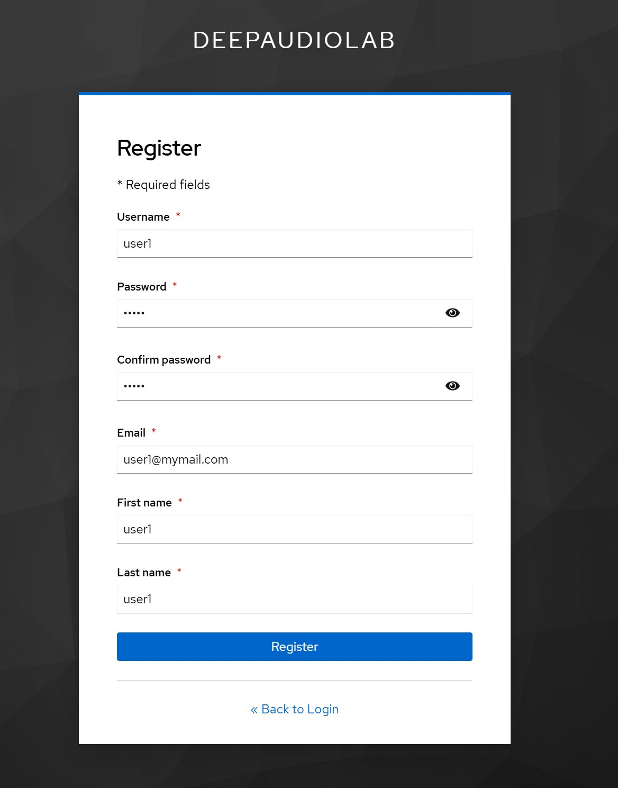

*Figure 2.1 — The registration form.*

### 2.2 Signing in

If you already have an account, sign in from the **Sign in to your account** page:

1. Enter your **Username or email**.

2. Enter your **Password** (use the eye icon to reveal it if needed).

3. Optionally tick **Remember me** so you stay signed in on this device.

4. Press **Sign In**.

If you have forgotten your password, use the **Forgot Password?** link. New users can jump straight to registration with the **Register** link at the bottom.

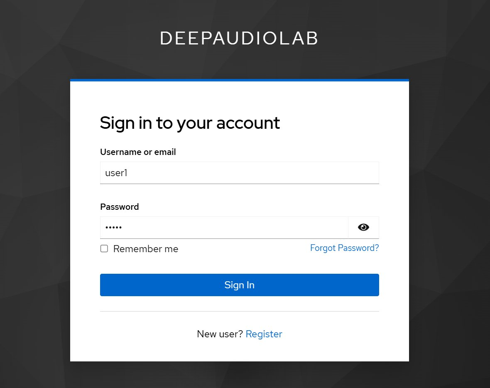

*Figure 2.2 — The sign-in page.*

## 3. The Homepage and Navigation

After signing in you land on the **Homepage**, which greets you with a **Welcome** message. On the left is the **sidebar**, your main way of moving around the app. In the top-right corner you can see your username and a **Logout** button.

The sidebar contains the following sections:

- **Homepage** — your dashboard of experiments.

- **Training** — configure and start new training runs.

- **Evaluation** — benchmark trained models against a test set.

- **Datasets** — upload and manage your audio datasets.

- **Deployment** — package a trained model for use elsewhere.

- **Activity Monitor** — track jobs that are currently running.

When you first sign in and have not created anything yet, the **Experiments** area of the Homepage is empty. As you create training runs it fills up with cards — more on that in Section 5.

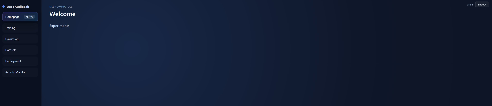

*Figure 3.1 — The Homepage on first sign-in, with the sidebar on the left and an empty Experiments area.*

> **Recommended order**
>
> Although you can click any tab at any time, the tabs are designed to be used in a workflow: **Datasets → Training → Evaluation → Deployment**. This manual follows that same order.

## 4. Datasets

Everything starts with data. The **Datasets** tab is where you upload your audio so it is available to your experiments. You only need to upload a dataset once; afterwards it can be reused across as many experiments as you like.

### 4.1 How your dataset folder must be organised

**Read this before uploading.** DeepAudioLab expects your dataset to follow a specific folder structure. Getting this right is essential — if the structure is wrong, your experiments will not work as expected.

The rules are:

- The top-level dataset folder contains one sub-folder per **split** (for example `train`, `validation` and `test`). You will choose later, during training, which sub-folder serves as which split.

- Inside each split sub-folder there is one sub-folder per **class**. The folder name is used as the class label.

- Inside each class sub-folder are the `.wav` audio files belonging to that class.

- At the top level, alongside the split folders, there must be a file called `class_mapping.json` that maps every class name to an integer.

**Example folder tree:**

```
my_dataset/
├── class_mapping.json
├── train/
│   ├── sinewave/
│   │   ├── audio_0001.wav
│   │   ├── audio_0002.wav
│   │   └── ...
│   ├── sawwave/
│   │   └── ...
│   └── squarewave/
│       └── ...
├── validation/
│   ├── sinewave/
│   ├── sawwave/
│   └── squarewave/
└── test/
    ├── sinewave/
    ├── sawwave/
    └── squarewave/
```

The `class_mapping.json` file simply lists every class name and the integer label it corresponds to:

```
{
  "gaussiannoise": 0,
  "sawwave": 1,
  "sinewave": 2,
  "squarewave": 3,
  "trianglewave": 4
}
```

> **Tip**
>
> The class names in `class_mapping.json` must match the class folder names inside each split exactly. Keep the same set of classes across your train, validation and test splits.

### 4.2 Uploading a dataset

Open the **Datasets** tab from the sidebar. The page invites you to upload datasets for easy access in your experiments.

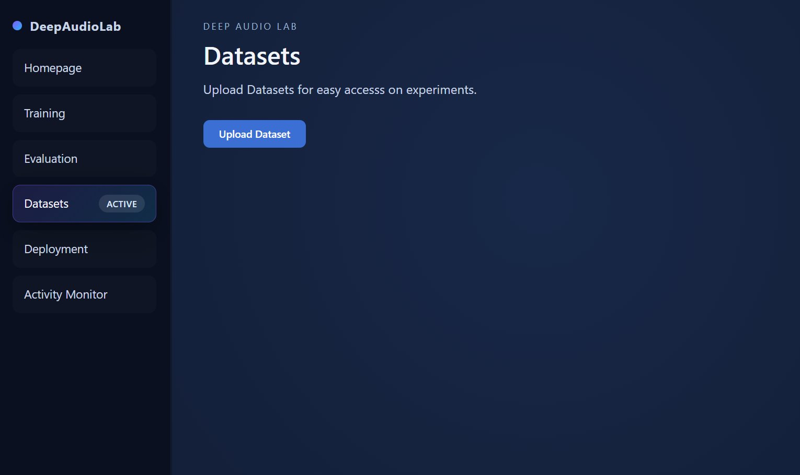

*Figure 4.1 — The Datasets tab.*

Press **Upload Dataset**. A **New Dataset** dialog appears. Give the dataset a **Name** and, optionally, a short **Description** to remind you what it contains. Then press **Continue**.

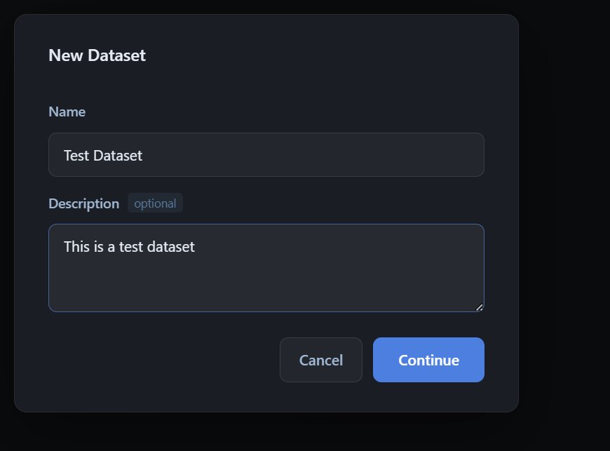

*Figure 4.2 — Naming a new dataset.*

Your computer's file browser opens. Navigate to your dataset, select the **top-level dataset folder** (the one containing the split folders and `class_mapping.json`), and press **Upload**.

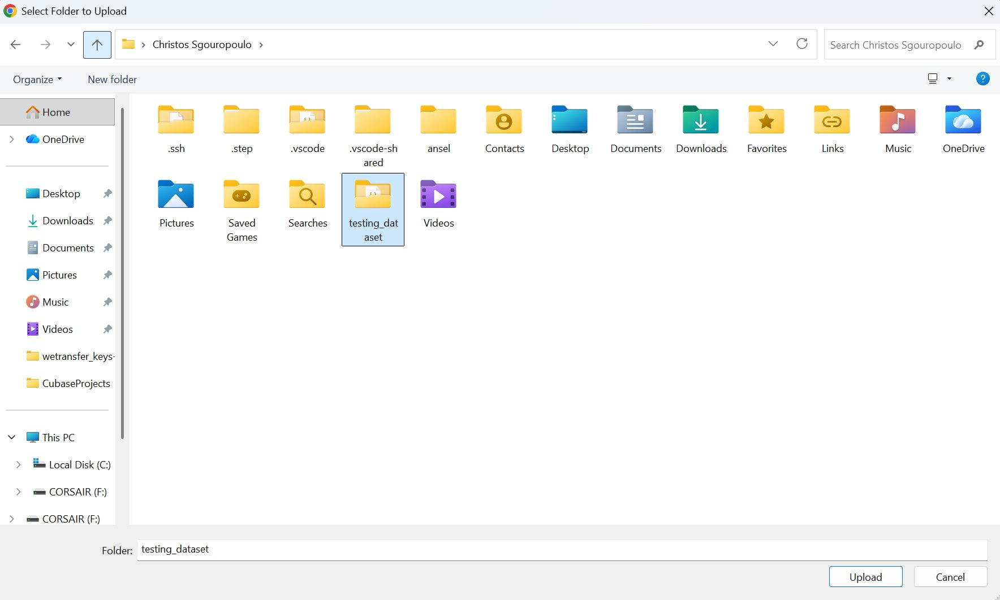

*Figure 4.3 — Selecting the dataset folder to upload.*

### 4.3 Reviewing your uploaded datasets

Once the upload finishes, the dataset appears under **Your Datasets** as a card. Each card shows the dataset name and description, the total number of audio (`.wav`) files, the total size (in MB or GB), and the date it was uploaded.

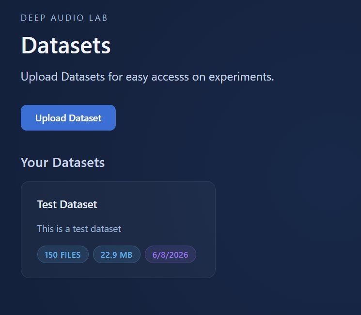

*Figure 4.4 — An uploaded dataset shown as a card.*

## 5. Training a Model

With a dataset uploaded, you are ready to train. Open the **Training** tab to configure and run a training job. As described in Section 1, a model is a **backbone** (extracts features) + a **pooling method** (aggregates them over time) + a **linear head** (maps to your classes). The Training page is organised into three tables, filled in from top to bottom.

### 5.1 Data Configuration

The first table tells DeepAudioLab what data to train on and how to read it.

- **Experiment Name** — a name for this run, used everywhere it appears in the app.

- **Description** (optional) — a short note about the experiment.

- **Select Dataset** — a drop-down listing all the datasets you have uploaded. Pick the one to train on.

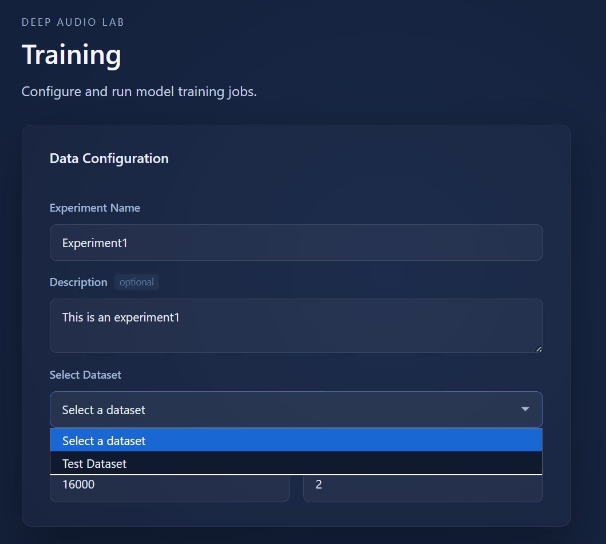

*Figure 5.1 — Naming the experiment and selecting a dataset.*

Once you select a dataset, you choose which of its sub-folders to use for each split:

- **Training Set** — the sub-folder containing your training data (in the example, the folder named `train`).

- **Validation Set** (optional) — the sub-folder for validation. If you leave this as None, DeepAudioLab will automatically hold out part of the training data using an 80/20 split.

- **Sampling Rate (Hz)** — the sampling rate of your audio data, e.g. `16000`.

- **Segment Duration (s)** — the length, in seconds, of the audio segment used for each example, e.g. `2`.

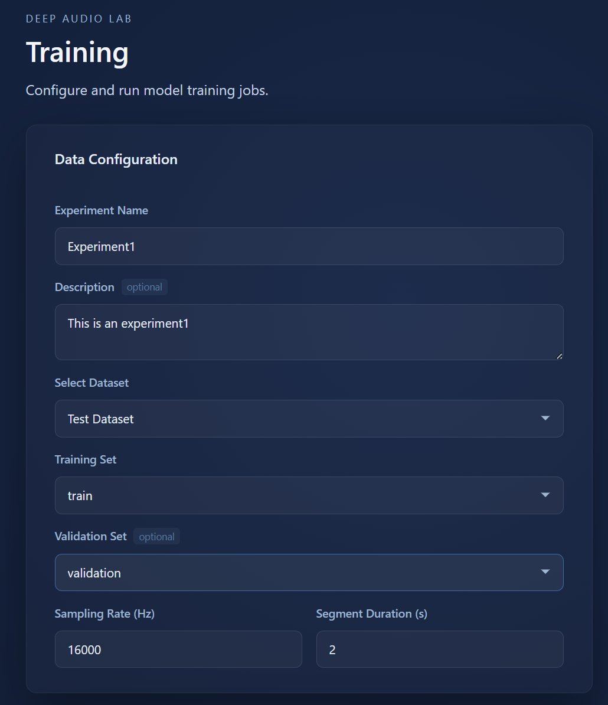

*Figure 5.2 — Choosing the training and validation splits and the audio settings.*

### 5.2 Model Settings

The second table defines the model itself.

- **Backbone** — the pretrained audio network that extracts features. The available choices are described in the table below.

- **Pooling Method** — how the backbone's features are aggregated along the time axis. Choose between `gap` (global average pooling), `simpool`, and `ep` (efficient probing).

- **Pretrained** — choose Yes to start from the backbone's pretrained weights, or No to start from scratch.

- **Freeze Backbone** — choose Yes to keep the backbone fixed during training so that only the linear head is trained, or No to train the whole model.

- **Sampling Rate (Hz)** — the sampling rate the model operates at. If this differs from your data's sampling rate (set in Data Configuration), your audio is resampled to this rate.

- **Checkpoint** — a name for the trained model, which is saved as a `.pt` file.

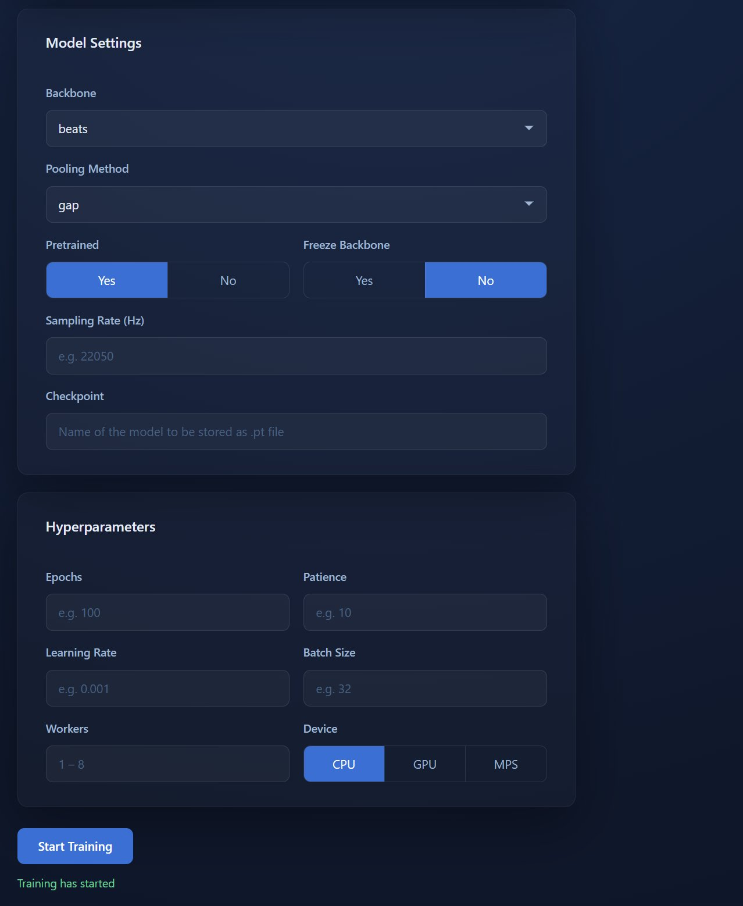

*Figure 5.3 — Model Settings (top) and Hyperparameters (bottom).*

#### Available backbones

Each backbone comes from published research. The table below gives a short description and a reference for each, so you can read more about the model you choose.

| **Backbone** | **Description** | **Reference** |
| --- | --- | --- |
| `beats` | A transformer-based audio model pre-trained in a self-supervised way using acoustic tokenizers; strong general-purpose audio representations. | Chen et al., “BEATs: Audio Pre-Training with Acoustic Tokenizers”, ICML 2023 (arXiv:2212.09058). |
| `passt` | The Patchout faSt Spectrogram Transformer (PaSST): an efficient audio spectrogram transformer trained with patchout for speed and regularisation. | Koutini et al., “Efficient Training of Audio Transformers with Patchout”, Interspeech 2022 (arXiv:2110.05069). |
| `mobilenet_05_as` | An efficient MobileNetV3-based CNN (width 0.5×) pre-trained on AudioSet via knowledge distillation. Lightweight and fast. | Schmid et al., “Efficient Large-scale Audio Tagging via Transformer-to-CNN Knowledge Distillation”, ICASSP 2023 (arXiv:2211.04772). |
| `mobilenet_10_as` | The same efficient CNN at width 1.0× — a balance of size and accuracy. AudioSet pre-trained. | Schmid et al., ICASSP 2023 (arXiv:2211.04772). |
| `mobilenet_40_as` | The largest of the efficient CNNs (width 4.0×) — highest accuracy, more compute. AudioSet pre-trained. | Schmid et al., ICASSP 2023 (arXiv:2211.04772). |

#### Pooling methods

| **Method** | **Description** | **Reference** |
| --- | --- | --- |
| `gap` | Global average pooling: averages the features over the time axis. Simple and robust. | — |
| `simpool` | A simple attention-based pooling mechanism that learns how to combine features across time. | “Keep It SimPool: Who Said Supervised Transformers Suffer from Attention Deficit?” |
| `ep` | Efficient probing: an attentive pooling approach designed for a good accuracy/efficiency trade-off. | “Attention, Please! Revisiting Attentive Probing Through the Lens of Efficiency” |

### 5.3 Hyperparameters

The third table controls how the training is run (shown at the bottom of Figure 5.3).

- **Epochs** — how many passes over the training data to perform.

- **Patience** — how many epochs without improvement to wait before stopping early.

- **Learning Rate** — the step size for training, e.g. `0.001`.

- **Batch Size** — how many examples are processed at once, e.g. `32`.

- **Workers** — the number of CPU workers used to load data (1–8).

- **Device** — where the training runs: `CPU`, `GPU` (you also choose a GPU index), or `MPS` for Apple Silicon Macs.

### 5.4 Starting the run

When all the fields are filled in, press **Start Training**. A green **“Training has started”** message confirms the job is on its way.

## 6. Monitoring Your Experiments

Once a run is submitted, DeepAudioLab gives you two complementary ways to follow it: the **Experiments** cards on the Homepage (for a per-experiment view and detailed results) and the **Activity Monitor** (for a live, at-a-glance view of jobs in progress).

### 6.1 The Homepage experiment cards

After submitting a training run, return to the **Homepage**. The **Experiments** area now shows a card for your experiment, with its name, description, and a status badge such as **TRAINING**.

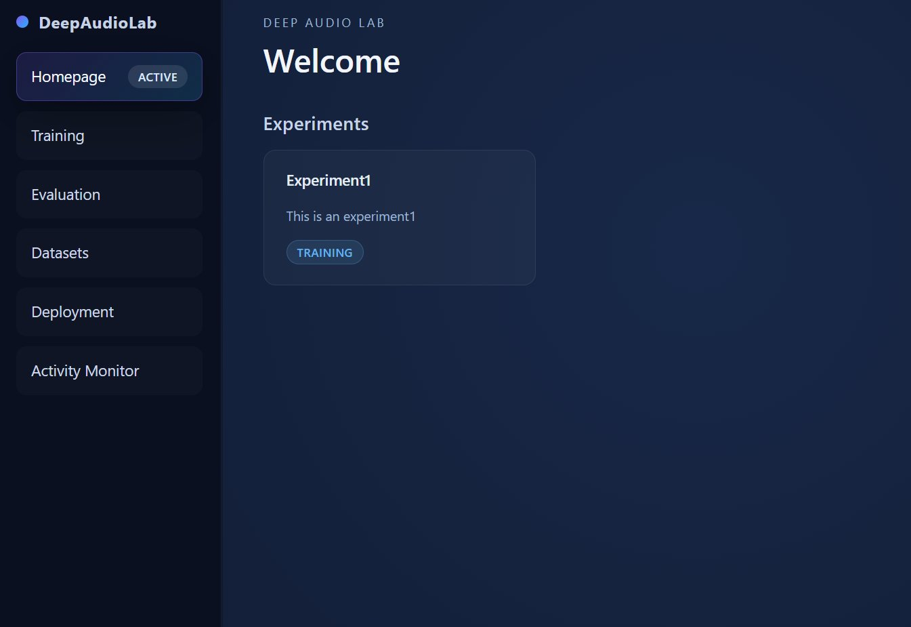

*Figure 6.1 — An experiment card on the Homepage while training is in progress.*

A card collects everything about an experiment over its lifetime. As you progress through training, evaluation and deployment, the card gains additional tags and buttons (see Sections 7 and 8).

### 6.2 The experiment detail page

Click a card to open its detail page. While the model is training, you can watch **real-time loss curves** — the training and validation loss plotted per epoch. Hover over the chart to read the exact loss values at any epoch. Below the chart, the **Experiment Parameters** section shows the full configuration of the run in a structured (JSON) view, so you always know exactly which settings produced a given model.

The page also has a **Back** button to return to the Homepage and a **Delete experiment** button to remove the run.

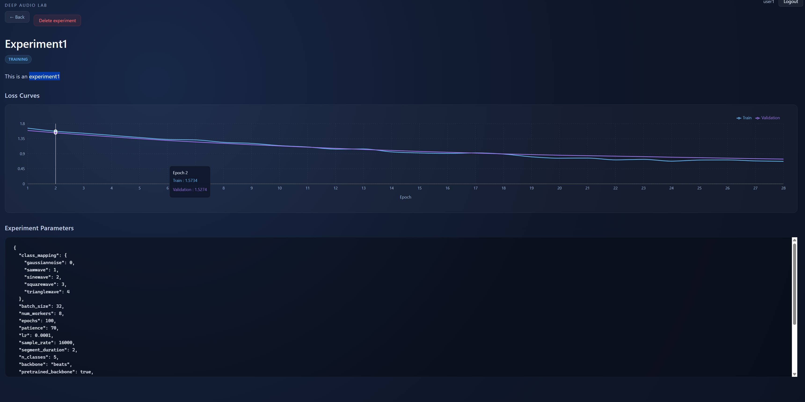

*Figure 6.2 — The experiment detail page: live loss curves and the full experiment parameters.*

The experiment parameters capture everything: the class mapping, batch size, number of workers, epochs, patience, learning rate, sampling rate, segment duration, number of classes, backbone, whether the backbone is pretrained and/or frozen, the pooling method, the checkpoint name, the dataset and split paths, and the device used.

### 6.3 The Activity Monitor

The **Activity Monitor** tab gives a live view of all the jobs that are currently running — training, evaluation and deployment alike. Each job appears as a row showing its status, when it started, the experiment name, the job type, a progress bar, the current train/validation/best-validation loss, the patience counter, elapsed time and an estimated time remaining (ETA).

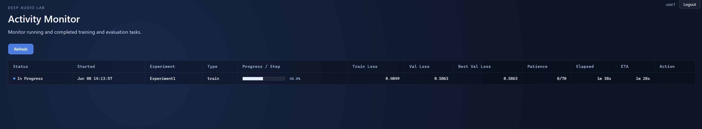

*Figure 6.3 — The Activity Monitor showing a training job in progress.*

The table does not update on its own. Press the **Refresh** button to pull the latest progress and status.

> **Where did my job go?**
>
> When a job finishes, it disappears from the Activity Monitor, which only lists active jobs. To see a completed run, go back to the **Homepage** and open its experiment card — the results live there.

## 7. Evaluating a Model

Once a model has finished training, you can benchmark it against a test set on the **Evaluation** tab. This tells you how well your model actually performs, broken down by class.

### 7.1 Running an evaluation

1. Open the **Evaluation** tab.

2. Use **Choose Experiment** to select a model. Only experiments that have **finished training** appear in this list.

3. Under **Evaluation Hyperparameters**, set the **Batch Size**, **Workers** (1–8) and **Device** (`CPU`, `GPU` or `MPS`).

4. Press **Run Evaluation**. As with training, a green **“Evaluation has started”** message confirms the job has begun, and it appears in the Activity Monitor while it runs.

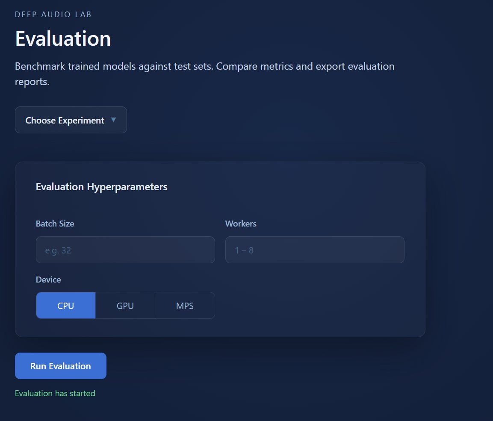

*Figure 7.1 — The Evaluation tab.*

### 7.2 Reading the results

When the evaluation finishes, the experiment's card on the Homepage gains an **EVALUATED** tag alongside its training status. Open the card to see the **Evaluation Results** — a classification report with, for every class, the **precision**, **recall**, **f1-score** and **support** (the number of test examples). Summary rows at the bottom give the overall **accuracy**, the **macro average** and the **weighted average**.

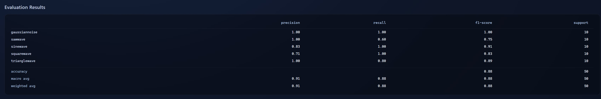

*Figure 7.2 — The Evaluation Results (classification report) on the experiment detail page.*

> **How to read it**
>
> **Precision** answers “when the model predicted this class, how often was it right?” **Recall** answers “of all the real examples of this class, how many did the model find?” The **f1-score** balances the two, and **support** tells you how many test examples each figure is based on.

## 8. Deploying a Model

The **Deployment** tab packages a trained model into a self-contained **inference bundle** that you can run anywhere. The bundle is a zip file containing everything needed to serve your model: unzip it, build the Docker image, and run the inference server locally or on any machine.

### 8.1 Creating a bundle

1. Open the **Deployment** tab.

2. Under **Create Bundle**, choose an **Experiment** from the drop-down. Only successful (trained) experiments can be bundled.

3. Type a **Bundle Name** (for example `exp_dpl` or `gtzan-classifier-v1`).

4. Press **Create Bundle**.

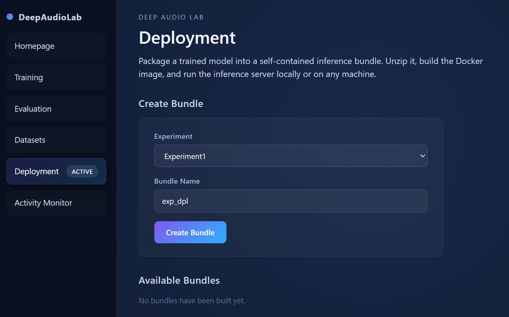

*Figure 8.1 — Creating a deployment bundle.*

Building a bundle is a job, so it appears in the **Activity Monitor** with the type `deployment` and a progress step such as *“Building bundle (60%)”*. Use **Refresh** to follow its progress.

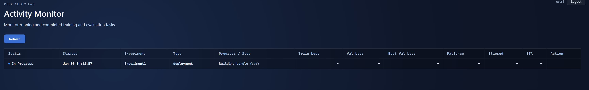

*Figure 8.2 — A deployment (bundle-building) job in the Activity Monitor.*

### 8.2 Downloading a bundle

When the build completes, the bundle appears under **Available Bundles** on the Deployment tab, listed by experiment and bundle name with a **Download** button. Press it to download the zip file.

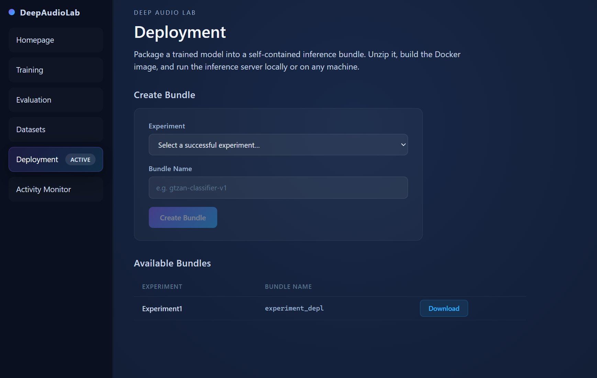

*Figure 8.3 — A completed bundle, ready to download.*

As a shortcut, once a bundle has been built for an experiment, a small **download icon** also appears on that experiment's card on the Homepage (next to the TRAINING and EVALUATED tags), letting you download the bundle directly from the dashboard.

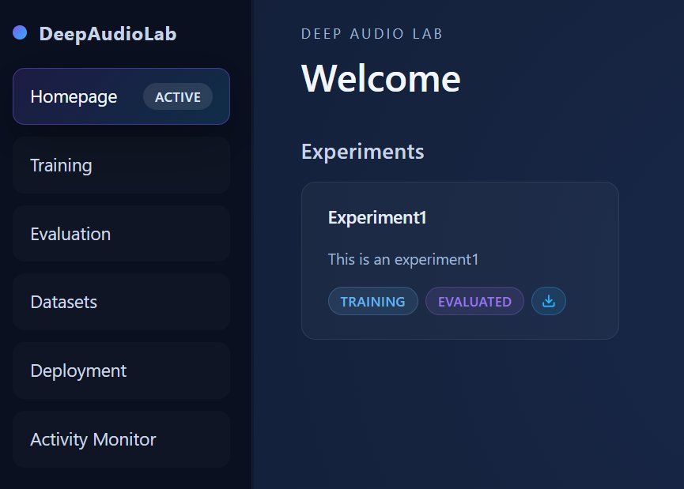

*Figure 8.4 — The download icon on a Homepage card after a bundle has been built.*

### 8.3 Running the bundle

To run your model from the downloaded bundle, follow the instructions in the `README` file included inside the zip. It explains how to unzip the bundle, build the Docker image, and start the inference server on your own machine.

## 9. Quick Reference

A condensed end-to-end checklist for a typical project:

1. **Prepare your data** in the required folder structure, with split folders, class folders, `.wav` files and a `class_mapping.json`. (Section 4.1)

2. **Upload** the dataset on the **Datasets** tab. (Section 4.2)

3. **Train** a model on the **Training** tab: fill in Data Configuration, Model Settings and Hyperparameters, then **Start Training**. (Section 5)

4. **Monitor** the run via the Homepage card (loss curves, parameters) and the **Activity Monitor**. (Section 6)

5. **Evaluate** the trained model on the **Evaluation** tab and read the classification report. (Section 7)

6. **Deploy** by creating a bundle on the **Deployment** tab, downloading it, and following the bundle's `README`. (Section 8)
